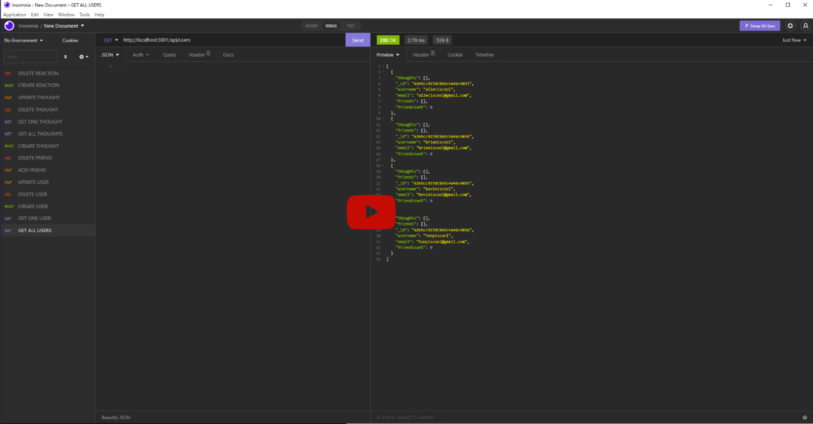

# Social Network API 📋


[](https://www.youtube.com/watch?v=-29yuKXv-JM)

## Description 📍
- A mockup of the backend of a social media application utilizing Node.js, Express, MongoDB and Mongoose.

## Table Of Contents 📜
* [Installation](#installation)
* [Youtube Walkthrough](#youtube)
* [Usage](#usage)
* [Technologies Used](#technologies-used)
* [License](#license)
* [Contribution Guidelines](#contribution-guidelines)
* [Github Repository](#github-repository)
* [Contact Information](#contact-information)

## Installation 
 1. Run ``` npm i ``` in the terminal to install the required dependencies.
 2. Run ```npm run seed``` in the terminal to seed user data.
 4. Run ```npm run start``` in the terminal to start the server.

## Youtube 
- [Youtube Walk Through](https://youtu.be/-29yuKXv-JM)

## Usage 
- As mentioned above, this application is solely the backend of a social media app. To use this application, you must have a REST client (ex: Insomnia) in order to test the routes. 

- There are a total of 3 models along with CRUD routes which are linked to controllers; these models, routes and controllers are arranged in folders/files based on their functionality.
<br>
<br>

**User Routes:**
```

1. /api/users
     - GET 
          - Get all users.
     - POST 
          - Create user.

2. /api/:userId
     - GET 
          - Get one user using their user id.
     - PUT
          - Update user using their user id.
     - DELETE
          - Delete user using their user id. All thoughts that a user has posted will be removed as well. 

3. /api/userId/friends/:friendId
     - PUT
          - Adds two users to each other's friends list using their respective user id.
     - DELETE
          - Removes two users from each other's friends list using their respective user id.
```
<br>

**Thought Routes:**

```
1. /api/thoughts
     - GET
          - Get all thoughts currently posted.
     - POST
          - Creates a thought. 'username' body must match a registered username.

2. /api/thoughts/:thoughtId
     - GET
          - Get one thought using its thought id.
     - DELETE
          - Delete one thought using its thought id.
     - PUT
          - Update a thought using its thought id.

3. /api/thoughts/:thoughtId/reactions
     - POST
          - Post a reaction to a thought using its thought id. 'Username' body must match a registered username.

4. /api/thoughts/:thoughtId/reactions/:reactionId
     - DELETE
          - Delete a reaction posted on a thought.
```

## Technologies Used
- Node.js
- Express.js
- MongoDB
- Mongoose
- Insomnia

## License 
- This project uses the following license:<br>
     - ***MIT***

## Contribution Guidelines 
- All contributors are welcome! Please don't hesitate to contact me below to contribute to this project.

## Github Repository 
- [Social Network API Repository](https://github.com/axe714/social-network-api)

## Contact Information 
- [Github Profile - Axe714](www.github.com/axe714)

- For inquiries/questions, please reach out to me at allecarzadon@gmail.com